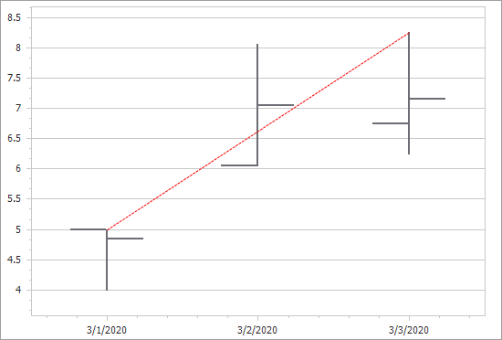

<!-- default badges list -->

<!-- default badges end -->

# Chart for WinForms - How to Add a Trend Line to a Chart

This example demonstrates how add a Trend Line to the stock chart at runtime. The following image illustrates the resulting UI:

<!-- default file list -->
## Files to Review 

* [Form1.cs](./CS/Form1.cs) (VB: [Form1.vb](./VB/Form1.vb))
<!-- default file list end -->

## Documentation 

- [Trend Lines](https://docs.devexpress.com/WindowsForms/6218/controls-and-libraries/chart-control/series/indicators/simple-indicators/trend-lines)
- [Stock Chart](https://docs.devexpress.com/WindowsForms/2987/controls-and-libraries/chart-control/series-views/2d-series-views/financial-series-views/stock-chart)

## More Examples 

[How to Display a Regression Line for a Series](https://github.com/DevExpress-Examples/how-to-display-a-regression-line-for-a-series-e1494)

